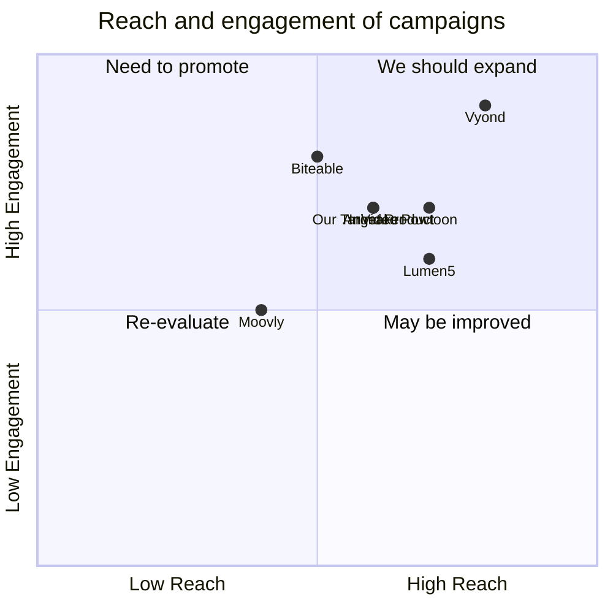

## Product Goals:
- Develop a user-friendly text to video application.
- Utilize artificial intelligence to generate high-quality videos.
- Provide a seamless user experience with efficient video rendering.

## User Stories:
- As a user,  to be able to input text and have it converted into a video.
- As a user,  to be able to customize the video by selecting different video styles and effects.
- As a user,  the application to automatically generate relevant visuals and animations based on the text input.
- As a user,  the option to add background music or voiceover to the generated videos.
- As a user,  the ability to preview and edit the video before finalizing and exporting it.

## Competitive Analysis:
- Animaker: A popular text to video application that offers a wide range of video templates and animations.
- Vyond: A professional video creation platform that provides advanced customization options and a vast library of assets.
- Lumen5: An AI-powered video creation platform that automatically generates video content from text.
- Biteable: A user-friendly video maker that allows users to create professional-looking videos with pre-made templates.
- InVideo: A video editing software that offers a variety of features for creating engaging videos.
- Moovly: An online video creation platform that provides a drag-and-drop interface and a library of customizable templates.
- Powtoon: A cloud-based video creation platform that offers a range of animation tools and templates.

## Competitive Quadrant Chart:


## Requirement Analysis:
The product should be a user-friendly text to video application that utilizes artificial intelligence to generate high-quality videos. It should provide a seamless user experience with efficient video rendering. The application should have customization options for selecting video styles, effects, background music, and voiceover. It should automatically generate relevant visuals and animations based on the text input. Users should be able to preview and edit the video before finalizing and exporting it.

## Requirement Pool:
```python
[
    ("Support for multiple video styles and effects", "P0"),
    ("Automatic generation of visuals and animations based on text input", "P0"),
    ("Ability to add background music or voiceover to videos", "P1"),
    ("Preview and editing functionality for videos", "P1"),
    ("Efficient video rendering", "P2")
]
```

## UI Design draft:
The application will have a simple and intuitive user interface. It will consist of the following elements:
- Text input box: Users can enter the text they want to convert into a video.
- Style selection: Users can choose from a variety of video styles and effects.
- Music/voiceover selection: Users can add background music or record a voiceover for the video.
- Preview window: Users can preview the video before finalizing and exporting it.
- Editing tools: Users can make edits to the video, such as trimming, adding text overlays, or adjusting the timing of visuals.
- Export button: Users can export the final video in their desired format.

The UI design will have a clean and modern style, with a responsive layout that adapts to different screen sizes.

## Anything UNCLEAR:

up for discussion. 
