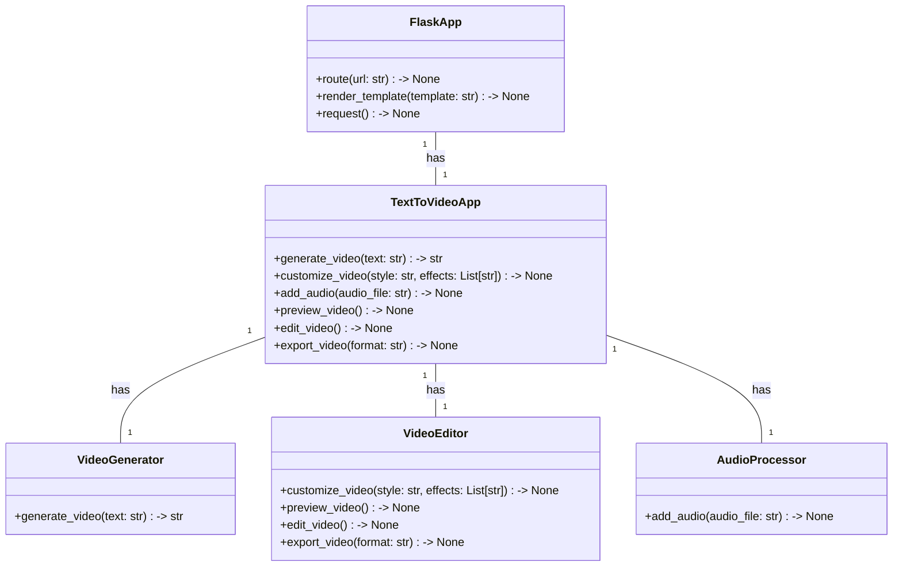
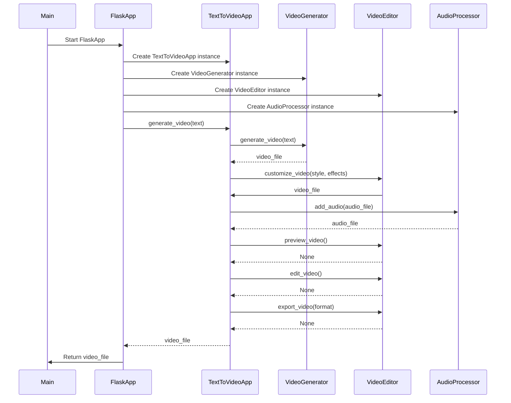

## Implementation approach:
For the text to video application, we can utilize the following open-source frameworks and libraries:

1. OpenAI GPT-3: We can use the OpenAI GPT-3 model for generating high-quality videos based on the text input. GPT-3 is a state-of-the-art language model that can generate human-like text and can be fine-tuned for specific tasks.

2. MoviePy: MoviePy is a Python library for video editing and video effects. We can use MoviePy to add video styles and effects to the generated videos. It provides a wide range of features for video editing, including trimming, cropping, and adding text overlays.

3. FFmpeg: FFmpeg is a powerful multimedia framework that can be used for video rendering and format conversion. We can use FFmpeg to efficiently render the videos and export them in different formats.

4. PyDub: PyDub is a simple and easy-to-use library for audio processing in Python. We can use PyDub to add background music or voiceover to the generated videos. It provides functions for manipulating audio files, such as merging, splitting, and applying effects.

5. Flask: Flask is a lightweight web framework for building web applications in Python. We can use Flask to create a user interface for the text to video application. It provides routing, request handling, and template rendering capabilities.

By combining these open-source tools, we can develop a user-friendly text to video application that utilizes artificial intelligence for generating high-quality videos.

## Python package name:
```python
"text_to_video"
```

## File list:
```python
[
    "main.py",
    "video_generator.py",
    "video_editor.py",
    "audio_processor.py",
    "templates/index.html",
    "static/style.css"
]
```

## Data structures and interface definitions:


## Program call flow:


## Anything UNCLEAR:
The requirement is clear to me.